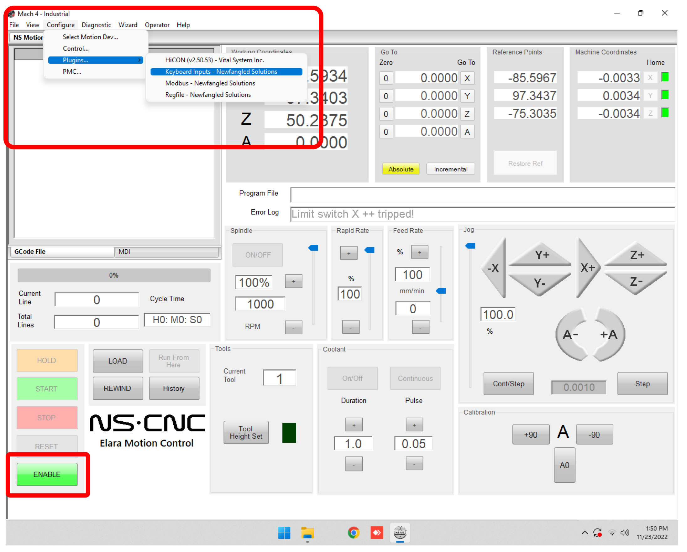
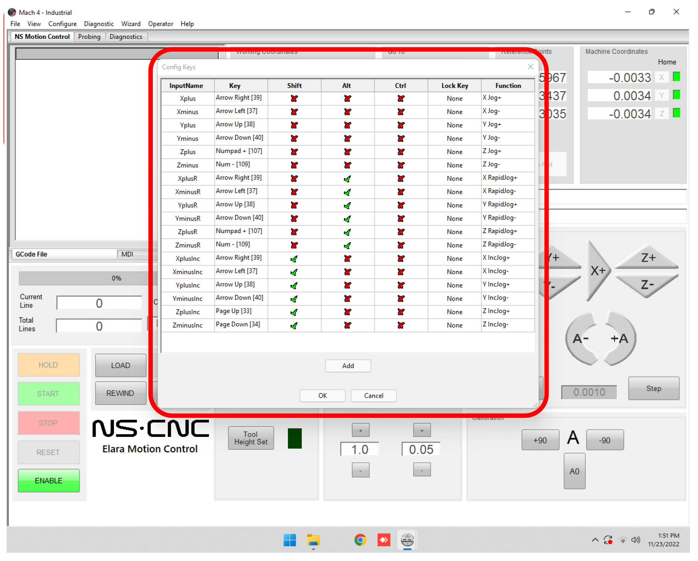
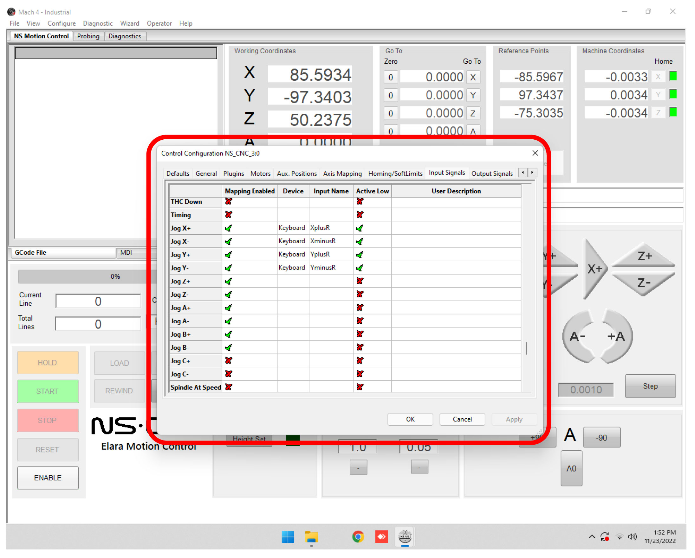
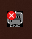
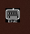

# Setup arrow keys for Jog

## Arrow keys setup
1. `disable` machine
2.  go to `Configure` > `Plugins` > `Keyboard Inputs`
    
3. In the **Config Keys** window, configure the options for arrow commands, or a combination (e.g shift+arrowup). then hit OK
    
4. open menu `Control` then on tab `Input Signals`.
5. Map the `Jog X+`, `Jog X-`, `Jog Y+`, `Jog Y-`, `Jog Z+`, `Jog Z-` and others as you'd like:
    
6. In the notification area in windows you may find  , if you click it you'll see it as:  then you can test your keyboard
    - ⚠️ Note that if enabled, even if you're not in Mach4, inputs will trigger which may cause accidents!
